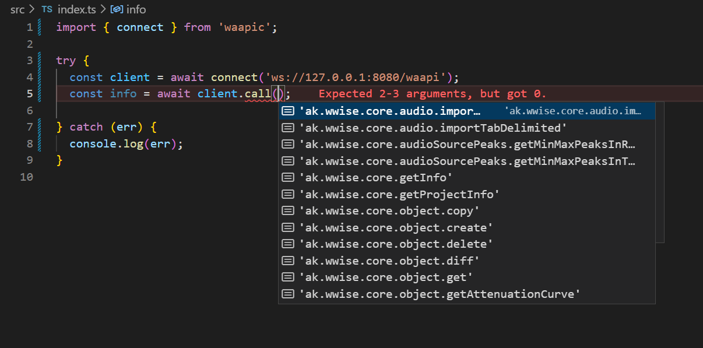
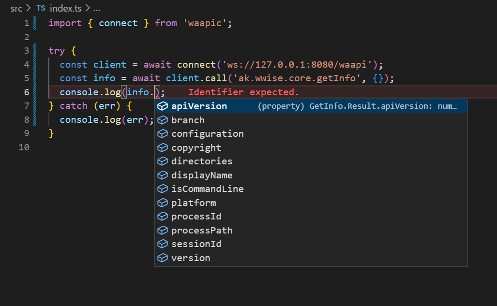

# waapic

A Wwise Authoring API Client Library in TypeScript.

## Features

- This library implements a WAAPI client with IDE autocompletion support.
- Most arguments, options and result are fully-typed.
- Subscribe has not implemented at this time.

## Usage

```ts
import { connect } from 'waapic';

try {
  const client = await connect('ws://127.0.0.1:8080/waapi');
  const info = await client.call('ak.wwise.core.getInfo', {});
  console.log(info.apiVersion);
} catch (err) {
  console.log(err);
}
```

## Screenshots




