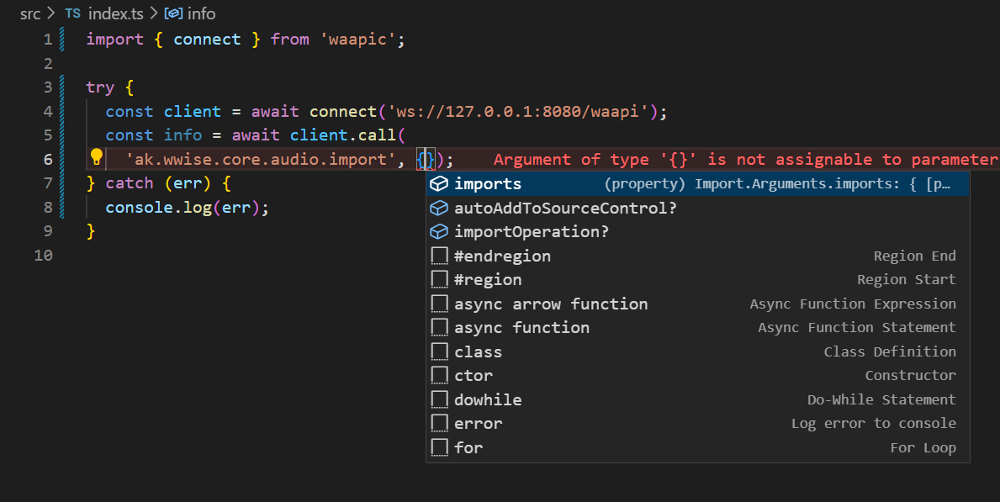

# WAAPIC


> DO NOT USE IN PRODUCTION ENVIRONMENT!

A Wwise Authoring API Client Library in TypeScript.

## Features

- This library implements a WAAPI client with IDE autocompletion support.
- Most arguments, options and result are fully-typed.
- Subscribe APIs has ~~not implemented at this time~~ implemented.

## Get

You can get waapic from NPM registry:

```
npm install waapic
```

Or, you can use this [template](https://github.com/mashisora/waapi-script-template)!

## Usage

```ts
import { connect } from 'waapic';

try {
  const client = await connect('ws://127.0.0.1:8080/waapi');
  const info = await client.call('ak.wwise.core.getInfo', {});
  console.log(info.apiVersion);
  await client.disconnect();
} catch (err) {
  console.log(err);
}
```

## Screenshots

### URI Autocomplete


### Arguments Autocomplete



### Result Autocomplete


## API List

Deprecated and private APIs are not listed and will never be implemented.

## Functions

| URI                                                            | STATUS |
| -------------------------------------------------------------- | ------ |
| `ak.wwise.core.audio.import`                                   |        |
| `ak.wwise.core.audio.importTabDelimited`                       |        |
| `ak.wwise.core.audioSourcePeaks.getMinMaxPeaksInRegion`        |        |
| `ak.wwise.core.audioSourcePeaks.getMinMaxPeaksInTrimmedRegion` |        |
| `ak.wwise.core.getInfo`                                        |        |
| `ak.wwise.core.getProjectInfo`                                 |        |
| `ak.wwise.core.log.get`                                        |        |
| `ak.wwise.core.object.copy`                                    |        |
| `ak.wwise.core.object.create`                                  |        |
| `ak.wwise.core.object.delete`                                  |        |
| `ak.wwise.core.object.diff`                                    |        |
| `ak.wwise.core.object.get`                                     |        |
| `ak.wwise.core.object.getAttenuationCurve`                     |        |
| `ak.wwise.core.object.getPropertyAndReferenceNames`            |        |
| `ak.wwise.core.object.getPropertyInfo`                         |        |
| `ak.wwise.core.object.getTypes`                                |        |
| `ak.wwise.core.object.isPropertyEnabled`                       |        |
| `ak.wwise.core.object.move`                                    |        |
| `ak.wwise.core.object.pasteProperties`                         |        |
| `ak.wwise.core.object.set`                                     |        |
| `ak.wwise.core.object.setAttenuationCurve`                     |        |
| `ak.wwise.core.object.setName`                                 |        |
| `ak.wwise.core.object.setNotes`                                |        |
| `ak.wwise.core.object.setProperty`                             |        |
| `ak.wwise.core.object.setRandomizer`                           |        |
| `ak.wwise.core.object.setReference`                            |        |
| `ak.wwise.core.profiler.enableProfilerData`                    |        |
| `ak.wwise.core.profiler.getAudioObjects`                       |        |
| `ak.wwise.core.profiler.getBusses`                             |        |
| `ak.wwise.core.profiler.getCursorTime`                         |        |
| `ak.wwise.core.profiler.getGameObjects`                        |        |
| `ak.wwise.core.profiler.getRTPCs`                              |        |
| `ak.wwise.core.profiler.getVoiceContributions`                 |        |
| `ak.wwise.core.profiler.getVoices`                             |        |
| `ak.wwise.core.profiler.startCapture`                          |        |
| `ak.wwise.core.profiler.stopCapture`                           |        |
| `ak.wwise.core.project.save`                                   |        |
| `ak.wwise.core.remote.connect`                                 |        |
| `ak.wwise.core.remote.disconnect`                              |        |
| `ak.wwise.core.remote.getAvailableConsoles`                    |        |
| `ak.wwise.core.remote.getConnectionStatus`                     |        |
| `ak.wwise.core.sound.setActiveSource`                          |        |
| `ak.wwise.core.soundbank.convertExternalSources`               |        |
| `ak.wwise.core.soundbank.generate`                             |        |
| `ak.wwise.core.soundbank.getInclusions`                        |        |
| `ak.wwise.core.soundbank.processDefinitionFiles`               |        |
| `ak.wwise.core.soundbank.setInclusions`                        |        |
| `ak.wwise.core.switchContainer.addAssignment`                  |        |
| `ak.wwise.core.switchContainer.getAssignments`                 |        |
| `ak.wwise.core.switchContainer.removeAssignment`               |        |
| `ak.wwise.core.transport.create`                               |        |
| `ak.wwise.core.transport.destroy`                              |        |
| `ak.wwise.core.transport.executeAction`                        |        |
| `ak.wwise.core.transport.getList`                              |        |
| `ak.wwise.core.transport.getState`                             |        |
| `ak.wwise.core.transport.prepare`                              |        |
| `ak.wwise.core.undo.beginGroup`                                |        |
| `ak.wwise.core.undo.cancelGroup`                               |        |
| `ak.wwise.core.undo.endGroup`                                  |        |
| `ak.wwise.core.undo.undo`                                      |        |
| `ak.wwise.debug.enableAsserts`                                 |        |
| `ak.wwise.debug.enableAutomationMode`                          |        |
| `ak.wwise.debug.testAssert`                                    |        |
| `ak.wwise.ui.bringToForeground`                                |        |
| `ak.wwise.ui.captureScreen`                                    |        |
| `ak.wwise.ui.commands.execute`                                 |        |
| `ak.wwise.ui.commands.getCommands`                             |        |
| `ak.wwise.ui.commands.register`                                |        |
| `ak.wwise.ui.commands.unregister`                              |        |
| `ak.wwise.ui.getSelectedObjects`                               |        |
| `ak.wwise.ui.project.close`                                    |        |
| `ak.wwise.ui.project.open`                                     |        |
| `ak.wwise.waapi.getFunctions`                                  |        |
| `ak.wwise.waapi.getSchema`                                     |        |
| `ak.wwise.waapi.getTopics`                                     |        |

## Topics

| URI                                                | STATUS |
| -------------------------------------------------- | ------ |
| `ak.wwise.core.audio.imported`                     |        |
| `ak.wwise.core.log.itemAdded`                      |        |
| `ak.wwise.core.object.attenuationCurveChanged`     |        |
| `ak.wwise.core.object.attenuationCurveLinkChanged` |        |
| `ak.wwise.core.object.childAdded`                  |        |
| `ak.wwise.core.object.childRemoved`                |        |
| `ak.wwise.core.object.created`                     |        |
| `ak.wwise.core.object.curveChanged`                |        |
| `ak.wwise.core.object.nameChanged`                 |        |
| `ak.wwise.core.object.notesChanged`                |        |
| `ak.wwise.core.object.postDeleted`                 |        |
| `ak.wwise.core.object.preDeleted`                  |        |
| `ak.wwise.core.object.propertyChanged`             |        |
| `ak.wwise.core.object.referenceChanged`            |        |
| `ak.wwise.core.profiler.captureLog.itemAdded`      |        |
| `ak.wwise.core.profiler.gameObjectRegistered`      |        |
| `ak.wwise.core.profiler.gameObjectReset`           |        |
| `ak.wwise.core.profiler.gameObjectUnregistered`    |        |
| `ak.wwise.core.profiler.stateChanged`              |        |
| `ak.wwise.core.profiler.switchChanged`             |        |
| `ak.wwise.core.project.loaded`                     |        |
| `ak.wwise.core.project.postClosed`                 |        |
| `ak.wwise.core.project.preClosed`                  |        |
| `ak.wwise.core.project.saved`                      |        |
| `ak.wwise.core.soundbank.generated`                |        |
| `ak.wwise.core.soundbank.generationDone`           |        |
| `ak.wwise.core.switchContainer.assignmentAdded`    |        |
| `ak.wwise.core.switchContainer.assignmentRemoved`  |        |
| `ak.wwise.core.transport.stateChanged`             |        |
| `ak.wwise.debug.assertFailed`                      |        |
| `ak.wwise.ui.commands.executed`                    |        |
| `ak.wwise.ui.selectionChanged`                     |        |
